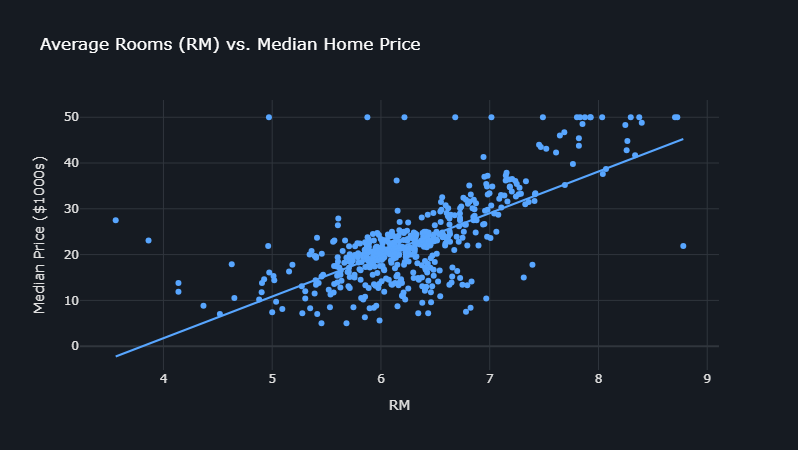
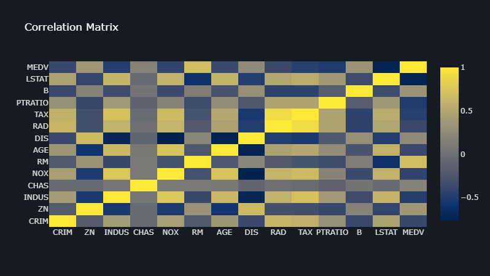

# House Price Prediction Analysis 🏡

This project provides a **comprehensive analysis and prediction tool for house prices** using a **Linear Regression model**.
It is implemented in Python and designed to be easily run and explored in a **Jupyter Notebook** environment.

The analysis covers:

* Model training & performance evaluation
* Data visualization with interactive plots
* A reusable prediction function for new inputs

---

## ✨ Features

* **Data Exploration**: Loads and summarizes key details of the dataset.
* **Model Training**: Trains a Linear Regression model on the house price dataset.
* **Performance Metrics**: Evaluates model accuracy with:

  * R² Score
  * Mean Absolute Error (MAE)
  * Root Mean Squared Error (RMSE)
* **Visualizations (Interactive - Plotly)**:

  * Feature vs. Price plots (e.g., rooms vs. price)
    
  * Feature importance bar chart (model coefficients)
  * Correlation heatmap (relationships between variables)
    
  * Actual vs. Predicted plot
  * Residual plot (model assumptions check)
    
    
  * Price distribution histograms (actual vs. predicted)
* **Prediction Function**: A reusable Python function to estimate house prices from user-provided feature values.

---

## 🚀 How to Run

1. **Install dependencies**:

   ```bash
   pip install pandas numpy scikit-learn plotly
   ```

2. **Dataset**: Ensure the dataset file is available in the project directory:

   ```
   House Prediction Data Set.csv
   ```

3. **Execution**:

   * Open Jupyter Notebook (or compatible environment).
   * Copy the code into the notebook cells.
   * Run all cells to view metrics, plots, and predictions.
